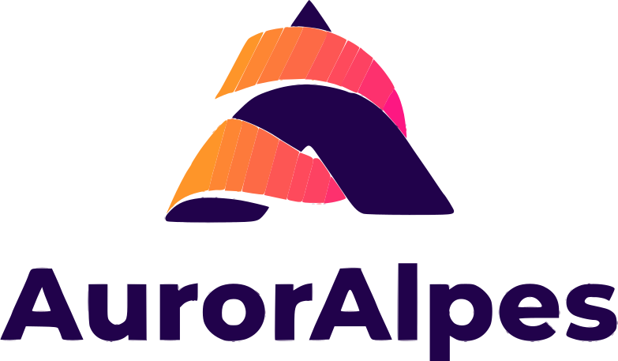

# Espace commentaires : 

Bienvenu dans l'espace commentaire du projet Serotine portée par l'association AurorAlpes.

## #1 Octobre
- [L'aphantasie](https://troy314.github.io/utterances/aphantasie.html)
- [Sudoku](https://troy314.github.io/utterances/aphantasie_sudoku.html)
- [Peut-on respirer par l'anus ?](https://troy314.github.io/utterances/respirer_par_anus.html)

