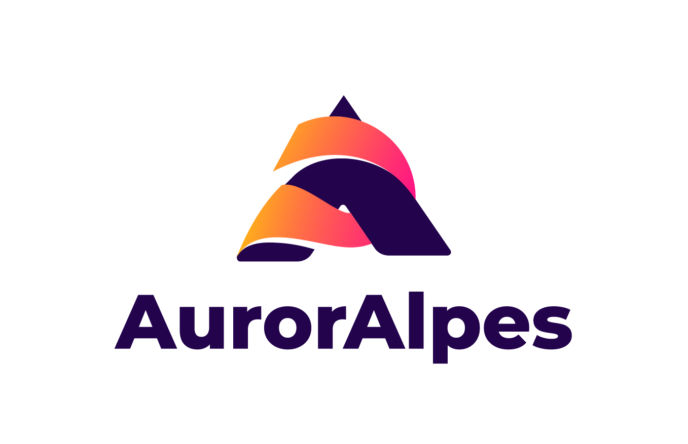

 by 

# Espace commentaires

Bienvenu dans l'espace commentaire du projet Serotine portée par l'association AurorAlpes.
Vous pouvez retrouver ci-dessous, les commentaires associés aux diférents numéros du webzine.

Afin de poster un commentaire, il est necessaire de creer un compte sur GitHub.

## #1 Octobre 2025
- [L'aphantasie](https://troy314.github.io/utterances/articles/aphantasie.html)
- [Sudoku](https://troy314.github.io/utterances/articles/aphantasie_sudoku.html)
- [Peut-on respirer par l'anus ?](https://troy314.github.io/utterances/articles/respirer_par_anus.html)

## #2 Novembre 2025
- Soon

## Crédits
Ce site est développé à partir du projet [utterances](https://github.com/utterance/utterances) développé par jdanyow

  
  by
  

